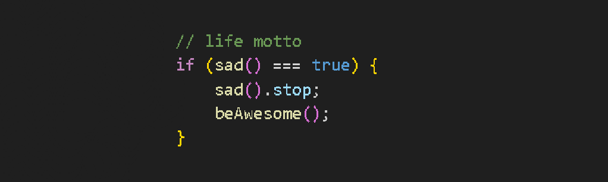

## :tada: Hi! I am Leonardo and welcome to my profile
I'm a front-end developer trying to avoid bugs haha!

I've been studying front-end since 2024 on Alura.

What made me start studying programming was the fact that I always wanted to know what was going on behind the beautiful part of the screen, and what made me study front-end was the ability that the front-end has to transform a simple code in art for the eyes.

###

## About me
- 🌎 I'm from Brazil
- 🎮 Love gaming
- 👽 Aways searching for an answer o.O
- 🎸 Love music and playing guitar(even though I don't know very well how to play the guitar) :D

###

<h2 align="left">I code with</h2>

  
  
  

###

  

###

# Thanks for passing by ❤️

###
